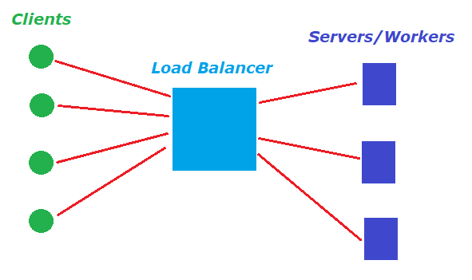

# Load-Balancer

### High Level Overview

Clients should connect to some **gateway** service which distributes the traffic to some **worker** nodes. The ways of which that distribution could be done are called a **load balancing algorithms**. Basically there are two types of them - **Dynamic** and **Static**.

> NOTE: [Read more](https://www.cloudflare.com/learning/performance/types-of-load-balancing-algorithms/) about load balancing algorithms.

## Sample implementation

For the purpose of keeping this simple, my implementation will consists of fairly primitive static load balancing algorithm. It will distributes the traffic equally in sequential order. For example if I have three worker servers *[1, 2, 3]*, ten requests will be distributed in the following order *[1, 2, 3, 1, 2, 3, 1, 2, 3, 1, 2, 3, 1]* where the digits indicate the server id.

### Project structure
* **~/load-balancer-server.js** contains the express framework implementation of the load balancer server.

* **~/workers/worker-server.js** contains the express framework implementation of the worker server.

* **~/utils** contains auth (cryptographic) and network (ipv4 addresses) usefull common logic.

* **~/strategies** contains the implementations of load balancing algorithms.

* **~/Dockerfile.balancer** contains docker containerization manual for the load balancer server node.

* **~/Dockerfile.worker** contains docker containerization manual for the worker server node.

* **~/benchmark.js** contains performance measure code for single-server app vs load-balanced one.

#### Load-Balancer API
Implementation is consisted of **three API endpoints**.
* **'/'** redirects to some of the workers.
* **'/workers'** returns the addresses of the registered workers, like: *["http://172.17.0.3:8080","http://172.17.0.4:8080","http://172.17.0.5:8080","http://172.17.0.6:8080"]* 
* **'/register-worker'** is responsible for accepting post requests from worker nodes in order to register them.

#### Worker API
Implementation is consisted of **one API endpoint**.
* **'/'** returns 1 second delayed message containing: *"Server: 'server_name'>, Request count: 'total_requests_proceeded_by_the_server'"*

### Breakdown of the usage workflow
#### Build

>Some "common sense" of docker :-):
>* View containers: `docker ps`
>* Kill container: `docker kill <container_id>`
>* View container details: `docker inspect <container_id>`
>* Attach to container process: `docker container attach <container_id>`

Two docker container images should be build. That of the load-balancer server and that of the worker server:

> **Load-balancer image build:** *docker build . -t david/load-balancer -f* Dockerfile.balancer

> **Worker image build:** *docker build . -t david/worker -f Dockerfile.worker*

#### Deploy
The load-balancer container should be deployed **first**. Thats because on start-up the load-balancer starts listening on **/register-worker** for nodes that want to register to it.

> **Deploy load-balancer container:** *docker run -p 3000:8080 -d david/load-balancer*

Then deploy couple of worker containers. Each worker server on start-up will send a post request containing **its address and signiture of it** to the **/register-worker** endpoint of the load-balancer server.

> **Deploy first worker container:** *docker run -p 3001:8080 -d -e NAME="First" -e LOAD_BALANCER_REGISTER="http://172.17.0.2:8080/register-worker" -d david/worker*
> **Deploy second worker container:** *docker run -p 3002:8080 -d -e NAME="Second" -e LOAD_BALANCER_REGISTER="http://172.17.0.2:8080/register-worker" -d david/worker*

#### Use
Make request to the '/' endpoint of the load-balancer server. It locates the worker which turn has come and sends the request to it. The worker server processes the request and returns response. The load-balancer routes this response to the client.
